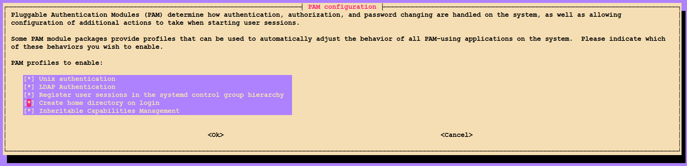

# Install LDAP server

```bash
apt update
apt install slapd debconf-utils ldap-utils ldapvi
```

During the installation, you will be asked to create an admin password for the LDAP directory

## Modify the default Directory Information Tree suffix

```bash
dpkg-reconfigure slapd
```

- Step by step to config the setting

    [image link](./image/dpkg-reconfigure slapd/)

---

## Add [openssh-lpk.ldif](openssh-lpk.ldif) in /etc/ldap/schema (Optional for SSH key conncetion)

```bash
dn: cn=openssh-lpk,cn=schema,cn=config
objectClass: olcSchemaConfig
cn: openssh-lpk
olcAttributeTypes: ( 1.3.6.1.4.1.24552.500.1.1.1.13 NAME 'sshPublicKey'
  DESC 'MANDATORY: OpenSSH Public key'
  EQUALITY octetStringMatch
  SYNTAX 1.3.6.1.4.1.1466.115.121.1.40 )
olcObjectClasses: ( 1.3.6.1.4.1.24552.500.1.1.2.0 NAME 'ldapPublicKey' SUP top AUXILIARY
  DESC 'MANDATORY: OpenSSH LPK objectclass'
  MAY ( sshPublicKey $ uid )
  )

```

## Add ldif to ldapadd (Optional for SSH key conncetion)

```bash
ldapadd -Y EXTERNAL -H ldapi:/// -f /etc/ldap/schema/core.ldif
ldapadd -Y EXTERNAL -H ldapi:/// -f /etc/ldap/schema/cosine.ldif
ldapadd -Y EXTERNAL -H ldapi:/// -f /etc/ldap/schema/nis.ldif
ldapadd -Y EXTERNAL -H ldapi:/// -f /etc/ldap/schema/inetorgperson.ldif
ldapadd -Y EXTERNAL -H ldapi:/// -f /etc/ldap/schema/openssh-lpk.ldif
```

Use `netstat -tulnp | grep slapd` to check whether slapd is listening to port 389

Ready to add people group and other informations to the ldap

### Change the port (Optional)
389 --> 3899
```
slapd -h "ldap://:3899/ ldapi:///" -F /etc/ldap/slapd.d
```

#### Related happened problem
LDAP-server conncetion failed
Failed message: **daemon bind(8) failed errno=98 (address already in use) slapd**
Solution:
1. change the config setting port from 389 -> 3899 after adding 3899 port
e.g.
```
vim /etc/default/slapd
> SLAPD_SERVICES="ldap://:3899/ ldapi:///"
```

2. Restart slapd
`systemctl restart slapd`

---


# Install LDAP client

Create a [ldap_ssh](ldap_ssh) file in /usr/local/bin 

```bash
#!/bin/bash
ldapsearch -b 'dc=example,dc=com,dc=tw' -H 'ldap://192.168.0.0/' -x '(&(objectClass=posixAccount)(uid='"$1"'))' sshPublicKey | sed -n '/^ /{H;d};/sshPublicKey:/x;$g;s/\n *//g;s/sshPublicKey: //gp'
```

Change the file permission of ldap_ssh

```bash
chmod 755 /usr/local/bin/ldap_ssh
```

Modify the sshd_config file in /etc/ssh

[/etc/ssh/sshd_config](sshd_config)


## Update ssh server

```bash
systemctl restart sshd
```

## Install pam nscd for ldap client

```bash
apt update
apt install libnss-ldap libpam-ldap ldap-utils nscd -y
```

## Setting config

```bash
dpkg-reconfigure ldap-auth-config
```

- Step by step to set the config

    [image link](./image/dpkg-reconfigure ldap-auth-config)


## Modify the `/etc/nsswitch.conf`

```bash
passwd:         compat files systemd ldap
group:          compat files systemd ldap
shadow:         compat files ldap
gshadow:        files

hosts:          files dns
networks:       files
...
```

**This step is for synchronizing and creating the usernames and groups in computing and logging Node.**

## Restart nsswitch

```bash
systemctl restart nscd
```
**This step is for synchronizing and creating the usernames and groups in computing Node and logging Node.**

## Modify `/etc/pam.d/common-password` (Optional)

Remove `use_authtok` from the following line

```bash
# here are the per-package modules (the "Primary" block)
password        [success=2 default=ignore]      pam_unix.so obscure sha512
password        [success=1 user_unknown=ignore default=die]     pam_ldap.so use_authtok try_first_pass
```

**This step is for password changing in Terminal.**

## Update pam config

```bash
pam-auth-update
```



# Backup and Restore LDAP data and config

<https://ubuntu.com/server/docs/service-ldap-backup-restore>

**Backup Bash Shell (Can use cron script to backup data)**
```
#!/bin/bash

set -e

BACKUP_PATH=/export/backup
SLAPCAT=/usr/sbin/slapcat

nice ${SLAPCAT} -b cn=config > ${BACKUP_PATH}/config.ldif
nice ${SLAPCAT} -b dc=example,dc=com > ${BACKUP_PATH}/example.com.ldif # edit dns to your LDAP server e.g.: dc=ccllab,dc=edu,dc=tw
chown root:root ${BACKUP_PATH}/*
chmod 600 ${BACKUP_PATH}/*.ldif
```
**Restore**

*When you already have database and running this bash shell, system will print command to remove already existed database*

```
#!/bin/bash

set -e

BACKUP_PATH=/export/backup
SLAPADD=/usr/sbin/slapadd

if [ -n "$(ls -l /var/lib/ldap/* 2>/dev/null)" -o -n "$(ls -l /etc/ldap/slapd.d/* 2>/dev/null)" ]; then
    echo Run the following to remove the existing db:
    echo sudo systemctl stop slapd.service
    echo sudo rm -rf /etc/ldap/slapd.d/* /var/lib/ldap/*
    exit 1
fi
sudo systemctl stop slapd.service || :
sudo slapadd -F /etc/ldap/slapd.d -b cn=config -l /export/backup/config.ldif
sudo slapadd -F /etc/ldap/slapd.d -b dc=example,dc=com -l /export/backup/example.com.ldif # edit dns to your LDAP server e.g.: dc=ccllab,dc=edu,dc=tw
sudo chown -R openldap:openldap /etc/ldap/slapd.d/
sudo chown -R openldap:openldap /var/lib/ldap/
sudo systemctl start slapd.service
```