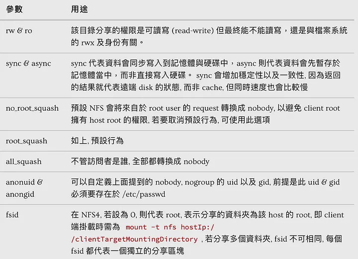

# This page is an installation guide for Network File System (NFS) server and client

## Server 

### 1. Update library and install server kernel
```BASH
apt update && apt install nfs-kernel-server
```

### 2. Create folder for sharing
```BASH
mkdir -p /exort/quota
```

### 3. Change owner of the shared folder
```BASH
chown nobody:nogroup /export/quota
```

### 4. Setting exoprt folder
```BASH
 vim /etc/exports
 ```
 ```vim
 /export/quota *(rw,sync,no_root_squash)
 ```
 


## Client

### 1. Update library and install client software
```BASH
apt update && apt install nfs-common
```

### 2. Start NFS client
```BASH
systemctl start nfs-common
```
If there has a problem shows log: **Failed to start nfs-common.service: Unit nfs-common.service is masked.**

> Solution Reference: [解决nfs-common.service is masked 问题](https://zhuanlan.zhihu.com/p/469398833)

### 3. Mount folder to your client from server
```BASH
mount -t nfs4 yourHostIp:/export /yourPrefered/emptyDirectoryLocation
```

### If you want to umount 
```BASH
umount /yourClientMountedDirectory
```

## Reference
1. [架設一個-nfs-server](https://medium.com/learn-or-die/%E6%9E%B6%E8%A8%AD%E4%B8%80%E5%80%8B-nfs-server-2c2fb00dc9fb)